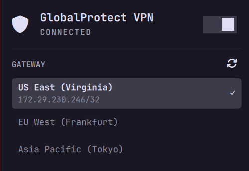

# GlobalProtect VPN



An [Omarchy](https://omarchy.org/) shell plugin for any GlobalProtect VPN
portal. Shows tunnel status in the bar (dim when disconnected) and lets you
connect/disconnect from a popup -- the bar icon itself is read-only and only
reflects connect state, it never mutates state on click.

The plugin bundles its own copy of a `gp-wrapper` CLI wrapper
(`bin/gp-wrapper`) around `gpclient`, plus a routing-conflict warning hook
(`bin/gp-wrapper-vpnc-script`) it installs to `/etc/vpnc/`. All the real
logic -- SSO auth, the singleton lock that refuses to run two `gpclient`
sessions at once (two sessions fighting over one routing table can turn into
a routing loop -- this has actually happened), DNS routing-domain injection,
IPv6-on-uplink disable -- lives in the bundled `gp-wrapper` script. Panel.qml
is a thin status/button UI around it.

## Setup

Click the bar icon to open the popup. If anything below is missing, a
**Requirements** section lists it with a one-click **Install** button (each
opens a visible terminal, since AUR builds / pacman / sudo all need to show
output or prompt for confirmation):

1. **`gpclient`** -- the GlobalProtect OpenConnect client the bundled wrapper
   shells out to. Installed from `globalprotect-openconnect-git` (AUR) --
   the one with SSO/browser-auth support; the vendor's own GlobalProtect
   client doesn't support most orgs' SSO login flow.
2. **`vpnc`** (pacman) -- provides `/etc/vpnc/vpnc-script`, which the routing
   hook delegates to.
3. **The routing hook** -- copies this plugin's bundled
   `gp-wrapper-vpnc-script` to `/etc/vpnc/gp-wrapper-vpnc-script`, the
   fixed path the wrapper passes to `gpclient --script`.
4. **Your portal hostname** -- type it into the "portal" field in the
   Requirements section and click Save (e.g. `gp.example.com`). Saved to
   `~/.config/houz42-global-protect/portal.conf`.

```bash
omarchy plugin add https://github.com/houz42/omarchy-global-protect.git --enable
```

## Usage

- The icon is full-color when connected, dim when disconnected.
- The switch next to the title connects/disconnects the *default* gateway --
  the last one you connected to, or the first discovered one if you've never
  connected via this plugin. This mirrors the Wi-Fi panel's power switch. If
  no gateway list has been discovered yet (fresh install, or the cache got
  cleared), turning the switch on connects straight away using gpclient's
  own `--auto-gateway` (tries gateways in priority order, no prompting) and
  populates the gateway list from that same connection's log in the
  background -- you don't need to click the GATEWAY refresh icon by hand
  first, and it's one SSO round trip, not a separate discover-then-connect.
- The gateway list is a selection list, not a bank of buttons: the connected
  gateway is sorted to the top, shaded, bold, with a checkmark and its tunnel
  address underneath. Click it again to disconnect, or click a different
  gateway to switch to it.
- Connecting/discovering runs **headless by default** -- no terminal window
  -- as long as `sudo -n true` succeeds (checked once when the panel loads),
  i.e. you have a standing NOPASSWD grant or a cached sudo timestamp. The
  browser still pops up on its own for SSO either way; the terminal was only
  ever there for sudo's password prompt (progress/errors now show in the
  panel header and desktop notifications instead). On an install where sudo
  *does* need a password, it falls back to a floating terminal automatically
  so the prompt has somewhere to go.
- DNS/IPv6 hardening re-applies itself automatically -- on every connect,
  on every resume from suspend (`gp-wrapper resume`, wired to
  `/etc/systemd/system-sleep/` -- the network link underneath a surviving
  tunnel gets rebuilt, which is exactly what regresses DNS to a
  poisoned/wrong resolver), and every 5 minutes while connected, to catch
  anything else that can silently reset it (Wi-Fi roaming, NetworkManager/
  systemd-resolved changes unrelated to this plugin, etc). No button, no
  need to remember -- both steps are idempotent and a no-op when already
  applied.

### Discovering gateways

Nothing about your portal's gateway list is hardcoded. Both the GATEWAY
refresh icon and the power switch (when it has no gateway list yet) run
`gp-wrapper connect-auto`: a single real connect using gpclient's own
`--auto-gateway` (tries gateways in priority order, no interactive picker).
Its verbose log carries the same portal config a dedicated discovery fetch
would, so the gateway list gets parsed out of it in the background --
`<entry name="FQDN">`/`<description>` pairs, cached to
`~/.cache/houz42-global-protect/gateways.tsv` (user-local, not part of this
repo) -- while the connection itself proceeds normally. One SSO round trip,
and you end up connected instead of just holding a fresh list.

Because of the same singleton-lock constraint the wrapper always enforces
(see below), refreshing while already connected still disconnects the
current session first -- that's not unique to discovery, it's true of any
gateway switch.

A plain `gp-wrapper discover` (rebuild the cached list *without* connecting)
still exists for CLI use, but the plugin itself no longer calls it.

## Settings

`refreshIntervalSec` (default `15`) -- set via
`omarchy bar set houz42.global-protect refreshIntervalSec <seconds>`.

## License

[MIT](LICENSE)
